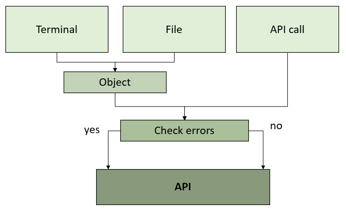
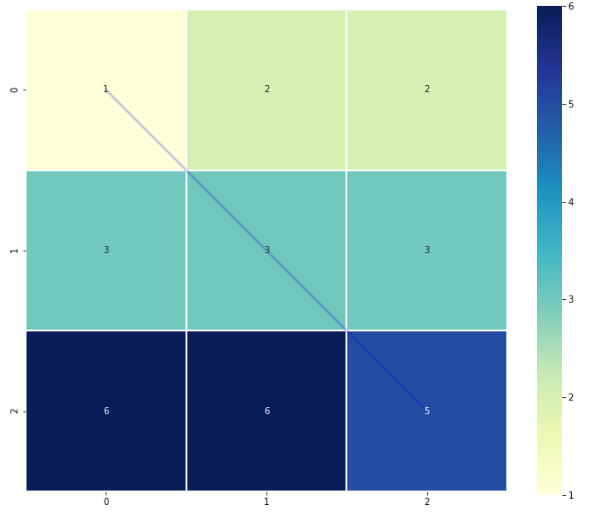

# Dynamic Time Warping 

This package allows to measure the similarity between two time sequences, i.e., it finds the optimal alignment between two time-dependent sequences. It allows the calculation for univariate and multivariate time series. Any distance available in `scipy.spatial.distance` can be used. An extra functionality has been incorporated to transform the resulting DTW matrix into an exponential kernel.

Univariate Time Series:
- It incorporates the possibility of visualising the cost matrix, as well as the path to reach the DTW distance value. This will allow it to be used in a didactic way, providing a better understanding of the method used.

Multivariate Time Series: 
- The calculation of dependent DTW and independent DTW is available.
- The calculation can be parallelised.

## Package structure 




## Installation

dtwParallel can be installed using [pip](https://pip.pypa.io/en/stable/), a tool
for installing Python packages. To do it, run the following command:
```
pip install -i https://test.pypi.org/simple/ dtwParallel
```

## Requirements

* Python >= 3.6.1


Note that you should have also the following packages installed in your system:
- numpy
- pandas
- matplotlib
- seaborn
- gower
- setuptools
- scipy


## Usage

Based on the previous scheme, this package can be used in three different contexts: 

**1) Calculation of the DTW distance with input from the terminal**

   An example covering all possible input parameters would be the following:
   ```
    python3 dtwParallel.py -x 1 2 3 -y 1 1 1 -d "euclidean" -t "d" False False
   ```
    
It is only necessary to indicate the x and y parameters. The rest, in case they are not set, will be selected from the default values defined in the `configuration.py` file. An example without the need to incorporate all parameters:
    
   ```
    python3 dtwParallel.py -x 1 2 3 -y 1 1 1
   ```
   **Remarks:**
   The calculation of the DTW distance from the command line is limited to simple examples that allow a quick understanding, due to the complexity of the terminal handling:
   - Univariate time series. 
   - Dependent DTW.

**2) Calculation of the DTW distance with input from a file**
    
   a) Example of calculation for time series from a CSV file: 
      
   The file used incorporates the data for the univariate x and y time series.
   
   ```
      python3 dtwParallel.py dtwParallel/Libro1.csv
   ```

   The file used incorporates the data for the multivariate x and y time series. 
   ```
      python3 dtwParallel.py dtwParallel/Libro2.csv
   ```

   b)  Example of calculation for time series from a .npy file: 

   ```
      python3 dtwParallel.py dtwParallel/X_train.npy dtwParallel/X_train.npy
   ```
   
   ```
      python3 dtwParallel.py dtwParallel/X_train.npy dtwParallel/X_test.npy
   ```

**3) Making use of the API** 
 ```
 from dtwParallel import dtw_functions
 ```
For Univariate Time Series: 
 ```
 dtw_functions.dtw(x,y,type_dtw, distance, MTS, get_visualization, check_erros)
 ```
For Multivariate Time Series: 
 ```
 dtw_functions.dtw_tensor(X_1, X_2, type_dtw, dist, n_threads, sigma, check_erros, dtw_to_kernel, sigma)
 ```


## Configuration
For any modification of the default parameters, the ``configuration.ini`` file can be edited.

The default values are:

```
[DEFAULT]
check_errors = True
distance = euclidean
type_dtw = d
mts = False
n_threads = -1
visualization = False
output_file = False
dtw_to_kernel = True
sigma = 1
``` 


## Reference 

If you use dtwParallel in your research papers, please refer to ...

[To be done]

## Examples

**1) Making use of the API** 

Different examples are shown making direct use of the API:

 ```
 from dtwParallel import dtw_functions
 from scipy.spatial import distance
 ```
For Univariate Time Series: 
 ```
 x = [1,2,3]
 y = [0,0,1]
 distance = distance.euclidean
 dtw_functions.dtw(x,y,type_dtw)
 
 [out]: 5.0
 ```
 
 ```
 x = [1,2,3]
 y = [0,0,1]
 distance = distance.euclidean
 get_visualization=True
 dtw_functions.dtw(x,y,type_dtw, get_visualization)
 
 [out]: 5.0
 ```


For Multivariate Time Series: 
 ```
from dtwParallel import dtw_functions
from scipy.spatial import distance

x = np.array([[3,5,8], 
             [5, 1,9]])

y = np.array([[2, 0,8],
             [4, 3,8]])
            
dtw_functions.dtw(x,y,"d", distance.euclidean, MTS=True)

 [out]: 7.548509256375962
 ```
 
 ```
 from dtwParallel import dtw_functions
 from scipy.spatial import distance
 import numpy as np
 x = np.load('X_train.npy')
 y = np.load('X_test.npy')
 
 dtw_functions.dtw_tensor_3d(x, y, "gower")

 [out]: 
 array([[2.47396197e+16, 6.12016408e+17, 4.75817098e+15, 1.02119724e+18],
       [9.07388652e+17, 1.54414468e+18, 9.36886443e+17, 8.90689643e+16],
       [2.23522660e+17, 8.60278687e+17, 2.53020450e+17, 7.72934957e+17],
       [1.68210525e+18, 2.31886127e+18, 1.71160304e+18, 6.85647630e+17]])
 ```


## License

Licensed under the BSD 2-Clause License.
